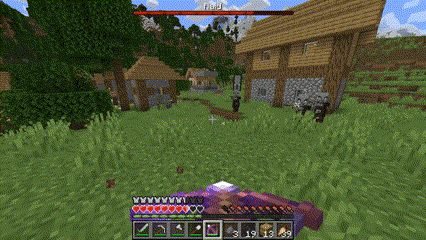
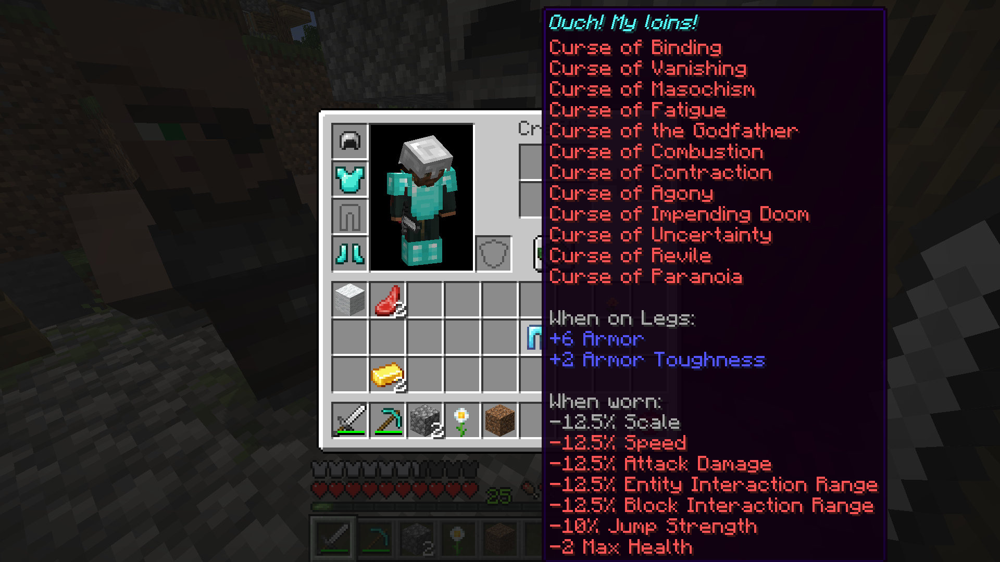
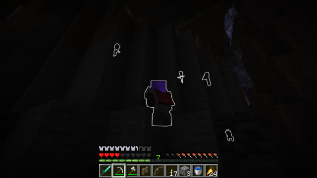

# enchantology (v1.5.1)

A data pack with 54 new enchantments spread across the world! Each enchantment can be acquired either normally via the enchanting table, exploring structures like Pillager Outposts and Bastions, or by fishing and other looting mechanisms. See the [catalog of enchantments](enchantments.md) for details behind each effect. Latest build for Minecraft 1.21.11.

## Release Notes

### v1.5.1. December 9th, 2025

+ Enchantology updated to Minecraft 1.21.11.

+ Enchantment changes:
    + The `Spear` can now utilize the following enchantments:
        + `Brutality`, `Certainty`, `Divinity`, `Leeching`, `Subjugation`, `Vigilance`, and `Vitality`.
    + Curse of Revile
        + Now affects `Nautilus`.
        + If curse is unequipped or affected mob is out of range, affected mob remains hostile for prescribed amount of time (mob-dependent). For example, if a player strikes a bee, the bee remains angry for 25 seconds. If you approach a bee while wearing `Curse of Revile`, they will remain hostile to you until you remove the enchantment or leave the vicinity, at which point they will remain hostile for 25 seconds longer.
+ Technical changes:
    + Fixed bug where `Certainty`, `Divinity`, `Leeching`, `Subjugation`, `Vigilance`, and `Vitality` were mistakenly applicable with the Mace.
    + Fixed the following loot tables:
        + `village_snowy_house` was missing bundles.
        + `end_city_treasure` and `nether bridge` were missing copper horse armor.
        + `jungle_temple` was missing leather.
        + `ruined_portal` was missing lodestone.
        + `woodland_mansion` was missing resin clump.

### v1.5.0. December 7th, 2025 (The Defense Update)

+ 7 New Enchantments (The Defense Update):
    + **Heartguard** (Shield)
        + Near-death experiences grant you regeneration and absorption for a short duration. Specifically, if the enchanted entity falls below 2 hearts, it is granted Absorption I (two hearts) and Regeneration I. This enchantment has a 60 second cooldown.
        + Dropped by `Ravager` (20% chance) and found in Woodland Mansions.
    + **Magic Protection** (Armor)
        + Reduced damage taken from magical sources including Dragon Breath, Poison, Potion of Instant Damage, Evoker fangs, Guardian beams, and ender pearl teleportation.
        + Incompatible with `Protection`, `Blast Protection`, `Fire Protection`, and `Projectile Protection`.
        + Found on random loot, enchanting table, and fishing.
    + **Salubrity** (Armor)
        + Increase maximum health by half a heart per level (max 4 hearts if all armor enchanted with Salubrity II).
        + Incompatible with `Curse of Agony`, `Curse of Impending Doom`, and `Protection`, but still compatible with other protection-based enchantments like `Blast Protection`, `Fire Protection`, and `Projectile Protection`. 
        + Found by Sniffer digging (6% chance).
    + **Sand Strider** (Boots)
        + Increased movement on sand, red sand, and suspicious sand, but slowly drains durability in the process.
        + Incompatible with `Depth Strider`.
        + Found in Desert Pyramids.
    + **Steadfast** (Horse Armor, Wolf Armor)
        + Additional damage reduction for horses and wolves.
        + Found by fishing, random loot, etc.
    + **Windshear** (Elytra)
        + Your wings slice into your opponents, dealing damage when gliding at high speeds.
        + Incompatible with `Windshield`.
        + Found in End Cities.
    + **Windshield** (Elytra)
        + Additional damage reduction (half that of Protection) for Elytras.
        + Incompatible with `Windshear`.
        + Found in End Cities.
+ Enchantment changes:
    + Audilibity
        + Enchanted player no longer glowing when sneaking.
        + Increased drop chance in ancient cities.
    + Certainty
        + Fixed bug where shulkers were not affected by enchantment.
    + Magnetic
        + Now compatible with copper armor (helmet, chestplate, leggings, and boots) and all lightning rod oxidation states.
+ Technical changes:
    + Fixed bug where vanilla enchantments `Fire Protection` and `Frost Walker` were made incompatible.
    + Updated `weight` and `anvil_cost` of 34 enchantments, which impact their probability and level cost, to better align with vanilla enchantments.
    + Tooltip order for every enchantment created. Vanilla enchantment tooltip order is unaffected.

### v1.4.0. November 3rd, 2025 (The Bow Update)

+ 6 New Enchantments:
    + **Cushioning** (Bow, Crossbow)
        + Arrows struck onto blocks create a magical cushion, preventing fall damage for those who land within it.
        + Incompatible with `Discordant` and `Transposition`.
        + Found in End Cities.
    + **Intuition** (Bow)
        + You are intuitive. Drawing your bow blinds you, but your arrows do 1.5x damage beyond your vision (5 blocks).
        + Found in Stronghold Libraries and rare Trial Chamber loot.
    + **Precision** (Crossbow)
        + Decrease projectile spread for crossbows with multishot. If multishot is not applied, does nothing.
        + Found in Pillager Outposts.
    + **Shrieking** (Bow)
        + Your arrows become pure energy, releasing a instant and powerful sonic charge.
        + Shriek penetrates both air and water, damage decreases with distance.
        + Incompatible with several enchantments; see wiki.
        + Found in Ancient Cities.
    + **Thunderbolting** (Crossbow)
        + Lightning strikes upon hitting your opponent (or a lightning rod) during a thunderstorm.
        + Incompatible with `Explosive`.
        + Found on random loot, enchanting table, fishing, and Underwater Ruins.
    + **Transposition** (Bow, Crossbow)
        + Upon striking an opponent, your positions are swapped.
        + Incompatible with `Cushioning`, `Gravity`, and `shrieking`.
        + Found in End Cities.
+ Enchantment changes:
    + Audibility
        + Reduced drop chances in ancient city chests.
    + Discordant
        + Now compatible with crossbows.
    + Frost Trotter
        + Added to `igloo_chest` loot table.

### v1.3.1. October 29th, 2025

+ Enchantology updated to Minecraft 1.21.10
    + Still compatible with 1.21.5-1.21.9.
+ Enchantment changes:
    + Reaching
        + Now compatible with Tridents and Shears.
    + Quarrying
        + Fixed bug where enchantment would not work with Efficiency / Haste values exceeding vanilla maximums (e.g., Efficiency VI + Haste III).

### v1.3.0. August 1st, 2025

+ 4 New Enchantments:
    + **Extension** (Breeze Rod)
        + Extend your block interaction range per level (max 3 levels / 1.5 blocks).
        + Found as rare Trial Chamber loot.
    + **Galloping** (Horse Armor)
        + Increased base movement speed.
        + Found on random loot and in savanna villages.
    + **Magnetic** (Lightning Rod)
        + Attract dropped loot from a greater distance (5 block radius). Can be used in your offhand.
        + Found as rare Trial Chamber loot.
    + **Curse of Repulsion** (Armor)
        + You are repulsive. Dropped loot is pushed away from you.
+ Enchantment changes:
    + Alchemic
        + Added to Witch loot table.
        + Added to rare Trial Chamber loot tables.
        + Removed from random loot tables.
    + Butchery
        + Reduced maximum level from III to I.
        + Removed `tellraw` messages to indicate when a mob has been sufficiently carved.
        + Improved entity selector logic.
    + Frost Trotter
        + Added to `village_snowy_house` loot table.
        + Removed from random loot tables.
    + Gnashing
        + Fixed bug where enchantment did not increase wolf damage.
    + Gravity
        + Now works on players and entities affected by `gravity` attribute.
        + Added sound effect upon hit.

+ Technical changes:
    + Renamed `exclusive_set` "magic" tags better clarity between which are exclusive and which are complementary.
    + `on_respawn` function added to `tick` functions to run on player respawn to catch unwanted behaviors.

### v1.2.2. July 13th, 2025

+ Enchantology updated to Minecraft 1.21.7
    + Still compatible with 1.21.5 & 1.21.6.

### v1.2.1. April 13th, 2025

+ Enchantology updated to Minecraft 1.21.5
+ Enchantment changes:
    + Alchemic
        + Fixed bug where opening container (e.g., chest) would remove empty bottle from mainhand.
    + Curse of Fatigue
        + Fixed incorrect armor compatibility.
    + Curse of the Godfather
        + No longer summons minecraft:interaction entity to attribute explosion to.
        + Fixed bug where all armor would break upon explosion.
        + Fixed bug where curse would activate without entering a vehicle.
    + Quarrying
        + Fixed bug where item modifiers would apply to items without "Quarrying" enchantment.
        + No longer uses item modifiers.
    + Added "Frost Trotter" and "Alchemic" to tag "enchantment/on_random_loot".
+ Technical Changes:
    + Added "fix" functions to repair item components of items impacted by "Quarrying" in v1.2.0.
        + Due to a bug in the prior verison, some items may have received item modifiers which treat that item as a netherite pickaxe. Due to the nature of NBT data, updating to the latest version of Enchantology does not automatically fix this. If only a handful of items are affected, it is recommended you simply spawn new items in. If the issue is more widespread, the function "enchantology:quarrying/fixes/remove_item_modifier" has been added to remove the item modifiers in bulk. Place the affected items in a **spruce chest boat** and a **repeating command block** (redstone activated) adjacent to it. In the command block, call the above function using "/function enchantology:quarrying/fixes/remove_item_modifier". Use a constant redstone signal (e.g., lever) to activate the commmand block and run the function for 2-3 seconds to remove the bug from the items in the chest. Turn off the command block, and remove your items.

### v1.2.0. February 23rd, 2025

+ 5 New Enchantments:
    + **Alchemic** (Helmet)
        + Potions have a 30% chance not to be consumed when drank.
    + **Frost Trotter** (Horse Armor)
        + Creates frosted ice blocks when walking over water, and grants damage immunity from certain blocks such as campfires and magma blocks when stepped on.
    + **Quarrying** (Netherite Pickaxe)
        + Insta-mine deepslate if paired with Efficiency V and Haste II.
        + Found in abandoned mineshafts.
    + **Curse of Impending Doom** (Armor)
        + You are fated to die. Reduces maximum health by half a heart every three seconds. You will die in 60 seconds, unless the curse is removed.
    + **Discordant** (Bow)
        + Victims struck by arrows from this enchanted bow teleport randomly nearby.
+ Enchantment changes:
    + "Explosive" now deals an extra 2.5 explosive damage upon a direct hit.
    + "Ironclad" made re-compatible with Thorns.
    + "Audibility" made re-compatible with Aqua Affinity.
    + "Gravity" now incompatible with Punch.
    + "exclusive_set/education" added to make education/speciality enchantments mutually exclusive.
        + Includes "Alchemic" and "Audibility" upon this release.
    + Magic enchantments separated into "school" tags (e.g., enchantology:magic_school/magic_fire)
        + Enchantments from the same school are compatible with each other, while different schools may be incompatible (e.g., magic_fire is compatible with magic_death enchantments, but incompatible with magic_ice enchantments)
        + Not all enchantments belong to a school (e.g., Reaching, Harvesting, etc.)
+ Technical changes:
    + Replaced individual predicate files for in-line predicate probabilities for "Butchery", "Curse of the Godfather", "Curse of Masochism", and "Paranoia"
    + Replaced summoned minecraft:villager with minecraft:interaction in "Curse of the Godfather"
    + Added "deepslate_variants" block tag
    + "exclusive_set/damage_over_time" removed
    + "exclusive_set/helmet" removed

### v1.1.0. January 18th, 2025

+ Enchantology updated to 1.21.4.
+ "Audilibity" weight in ancient city chests decreased from 3 to 2.
+ "Vitality" weight in bastion treasure chests decreased from 3 to 2.
+ "Vitality" removed from the enchanting table.
+ "Emolation", which was mispelled, properly renamed to "Immolation".
+ Jump height reduction from "Curse of Contraction" changed from -12.5% to -10% per armor piece.
+ Tags added for entities affected by "Curse of Revile" and items enchantable with "Dexterity". 

### v1.0.1. October 15th, 2024
+ enchantments.md added.
+ "Curse of Contraction" now reduces entity attributes by 12.5% per armor piece instead of a flat 50%.
+ "Subjugation" no longer available in enchanting table, only available in Pillager Outposts and Woodland Mansions
+ Added usage examples to readme.md.
   + Note: explosion particles retextured by the [Fire Rekindled](https://www.curseforge.com/minecraft/texture-packs/fire-rekindled) resource pack.

### v1.0.0. October 14th, 2024
+ Repository created (happy birthday!)
+ The following 32 enchantments have been added:
    + **Audibility**
    + **Brutality**
    + **Butchery**
    + **Certainty**
    + **Curse of Agony**
    + **Curse of Combustion**
    + **Curse of Contraction**
    + **Curse of Fatigue**
    + **Curse of the Godfather**
    + **Curse of Masochism**
    + **Curse of Paranoia**
    + **Curse of Revile**
    + **Curse of Uncertainty**
    + **Dexterity**
    + **Divinity**
    + **Emolation**
    + **Escalation**
    + **Explosive**
    + **Gnashing**
    + **Gravity**
    + **Harvesting**
    + **Ironclad**
    + **Lacerating**
    + **Leeching**
    + **Oppression**
    + **Reaching**
    + **Shattering**
    + **Subjugation**
    + **Vigilance**
    + **Vitality**
    + **Will of Animus**
    + **Withering**
