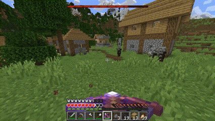
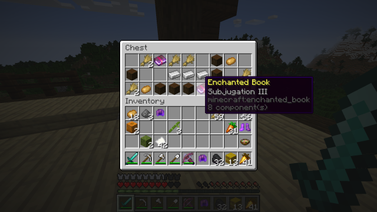
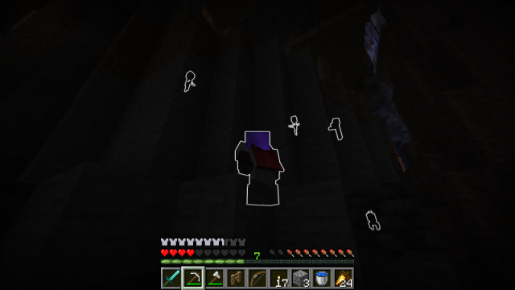

# enchantology (v1.2.2)

A datapack with 37 new enchantments spread across the world! Each enchantment can be acquired either normally via the enchanting table, exploring structures like Pillager Outposts and Bastions, or by fishing and other looting mechanisms. See the [catalog of enchantments](enchantments.md) for details behind each effect. Latest build for Minecraft 1.21.7.

## Release Notes

### v1.2.2. July 13th, 2025

+ Enchantology updated to Minecraft 1.21.7
    + Still compatible with 1.21.5 & 1.21.6.

### v1.2.1. April 13th, 2025

+ Enchantology updated to Minecraft 1.21.5
+ Enchantment changes:
    + Alchemic
        + Fixed bug where opening container (e.g., chest) would remove empty bottle from mainhand.
    + Curse of Fatigue
        + Fixed incorrect armor compatibility.
    + Curse of the Godfather
        + No longer summons minecraft:interaction entity to attribute explosion to.
        + Fixed bug where all armor would break upon explosion.
        + Fixed bug where curse would activate without entering a vehicle.
    + Quarrying
        + Fixed bug where item modifiers would apply to items without "Quarrying" enchantment.
        + No longer uses item modifiers.
    + Added "Frost Trotter" and "Alchemic" to tag "enchantment/on_random_loot".
+ Technical Changes:
    + Added "fix" functions to repair item components of items impacted by "Quarrying" in v1.2.0.
        + Due to a bug in the prior verison, some items may have received item modifiers which treat that item as a netherite pickaxe. Due to the nature of NBT data, updating to the latest version of Enchantology does not automatically fix this. If only a handful of items are affected, it is recommended you simply spawn new items in. If the issue is more widespread, the function "enchantology:quarrying/fixes/remove_item_modifier" has been added to remove the item modifiers in bulk. Place the affected items in a **spruce chest boat** and a **repeating command block** (redstone activated) adjacent to it. In the command block, call the above function using "/function enchantology:quarrying/fixes/remove_item_modifier". Use a constant redstone signal (e.g., lever) to activate the commmand block and run the function for 2-3 seconds to remove the bug from the items in the chest. Turn off the command block, and remove your items.

### v1.2.0. February 23rd, 2025

+ 5 New Enchantments:
    + **Alchemic** (Helmet)
        + Potions have a 30% chance not to be consumed when drank.
    + **Frost Trotter** (Horse Armor)
        + Creates frosted ice blocks when walking over water, and grants damage immunity from certain blocks such as campfires and magma blocks when stepped on.
    + **Quarrying** (Netherite Pickaxe)
        + Insta-mine deepslate if paired with Efficiency V and Haste II.
        + Found in abandoned mineshafts.
    + **Curse of Impending Doom** (Armor)
        + You are fated to die. Reduces maximum health by half a heart every three seconds. You will die in 60 seconds, unless the curse is removed.
    + **Discordant** (Bow)
        + Victims struck by arrows from this enchanted bow teleport randomly nearby.
+ Enchantment changes:
    + "Explosive" now deals an extra 2.5 explosive damage upon a direct hit.
    + "Ironclad" made re-compatible with Thorns.
    + "Audibility" made re-compatible with Aqua Affinity.
    + "Gravity" now imcompatible with Punch.
    + "exclusive_set/education" added to make education/speciality enchantments mutually exclusive.
        + Includes "Alchemic" and "Audibility" upon this release.
    + Magic enchantments separated into "school" tags (e.g., enchantology:magic_school/magic_fire)
        + Enchantments from the same school are compatible with each other, while different schools may be incompatible (e.g., magic_fire is compatible with magic_death enchantments, but incompatible with magic_ice enchantments)
        + Not all enchantments belong to a school (e.g., Reaching, Harvesting, etc.)
+ Technical changes:
    + Replaced individual predicate files for in-line predicate probabilities for "Butchery", "Curse of the Godfather", "Curse of Masochism", and "Paranoia"
    + Replaced summoned minecraft:villager with minecraft:interaction in "Curse of the Godfather"
    + Added "deepslate_variants" block tag
    + "exclusive_set/damage_over_time" removed
    + "exclusive_set/helmet" removed

### v1.1.0. January 18th, 2025

+ Enchantology updated to 1.21.4.
+ "Audilibity" weight in ancient city chests decreased from 3 to 2.
+ "Vitality" weight in bastion treasure chests decreased from 3 to 2.
+ "Vitality" removed from the enchanting table.
+ "Emolation", which was mispelled, properly renamed to "Immolation".
+ Jump height reduction from "Curse of Contraction" changed from -12.5% to -10% per armor piece.
+ Tags added for entities affected by "Curse of Revile" and items enchantable with "Dexterity". 

### v1.0.1. October 15th, 2024
+ enchantments.md added.
+ "Curse of Contraction" now reduces entity attributes by 12.5% per armor piece instead of a flat 50%.
+ "Subjugation" no longer available in enchanting table, only available in Pillager Outposts and Woodland Mansions
+ Added usage examples to readme.md.
   + Note: explosion particles retextured by the [Fire Rekindled](https://www.curseforge.com/minecraft/texture-packs/fire-rekindled) resource pack.

### v1.0.0. October 14th, 2024
+ Repository created (happy birthday!)
+ The following 32 enchantments have been added:
    + **Audibility**
    + **Brutality**
    + **Butchery**
    + **Certainty**
    + **Curse of Agony**
    + **Curse of Combustion**
    + **Curse of Contraction**
    + **Curse of Fatigue**
    + **Curse of the Godfather**
    + **Curse of Masochism**
    + **Curse of Paranoia**
    + **Curse of Revile**
    + **Curse of Uncertainty**
    + **Dexterity**
    + **Divinity**
    + **Emolation**
    + **Escalation**
    + **Explosive**
    + **Gnashing**
    + **Gravity**
    + **Harvesting**
    + **Ironclad**
    + **Lacerating**
    + **Leeching**
    + **Oppression**
    + **Reaching**
    + **Shattering**
    + **Subjugation**
    + **Vigilance**
    + **Vitality**
    + **Will of Animus**
    + **Withering**
